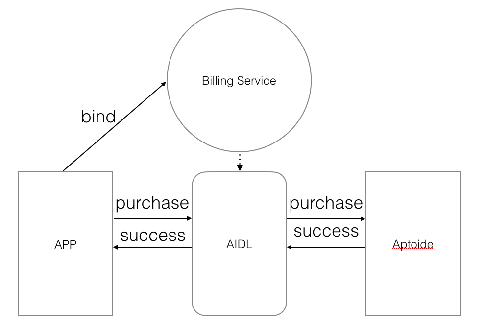

# Aptoide IAB

Aptoide IAB lets you sell digital content from inside applications.

## Architecture

Aptoide exposes a Android Service which your application should bind with. Once bound to Aptoide service your application can start communicating over IPC using an AIDL inteface.

## Google Play IAB to Aptoide IAB Migration

### AIDL

Like Google Play IAB, Aptoide IAB uses a .AIDL file in order to communicate with Aptoide service. The package for your .AIDL must be **cm.aptoide.pt.iab** instead of **com.android.vending.billing**. Both Aptoide and Google .AIDL files are identical, but you need to rename **IInAppBillingService.aild** to **AptoideInAppBillingService.aidl**.

### Permissions

Your application needs a permission to allow it to perform billing actions with Aptoide IAB. The permission is declared in **AndroidManifest.xml** of your application. Google Play IAB already declares a permision with name **com.android.vending.BILLING** you should rename it to **cm.aptoide.pt.permission.BILLING**.

**Google Play IAB**

	<uses-permission android:name="com.android.vending.BILLING" />

**Aptoide IAB**

	<uses-permission android:name="cm.aptoide.pt.permission.BILLING" />

### Service Connection

In order to communicate with Aptoide IAB your application must bind to a service the same way Google Play IAB. Google Play IAB Intent action and package must be updated from **com.android.vending.billing.InAppBillingService.BIND** to **cm.aptoide.pt.iab.action.BIND** and from **com.android.vending** to **cm.aptoide.pt** respectively.

**Google IAB Service Intent**

	Intent serviceIntent = new Intent("com.android.vending.billing.InAppBillingService.BIND");
	serviceIntent.setPackage("com.android.vending");

**Aptoide IAB Service Intent**

	Intent serviceIntent = new Intent("cm.aptoide.pt.iab.action.BIND");
	serviceIntent.setPackage("cm.aptoide.pt");
	

### Aptoide Public Key

Just like Google Play IAB, Aptoide IAB also exposes a public key. You should use Aptoide Public Key to verify your purchases. It works exactly like Google Play IAB key so you just need to replace each other.

To find your Aptoide Public key go to [Aptoide Back Office -> My Apps -> Catalogue -> Certified Apps](https://www.aptoide.com/account/certified-apps). You can click In-app button and the key will be presented.

### Purchase Broadcast

Google Play IAB broadcasts and Intent with action **com.android.vending.billing.PURCHASES_UPDATED**. Aptoide IAB does not do that therefore any code related with listening to that Intent can be removed.

# Known Issues

* Aptoide IAB is not compliant with [Google Play IAB v5](https://developer.android.com/google/play/billing/versions.html). Calls to **getBuyIntentToReplaceSkus** method will always fail.

